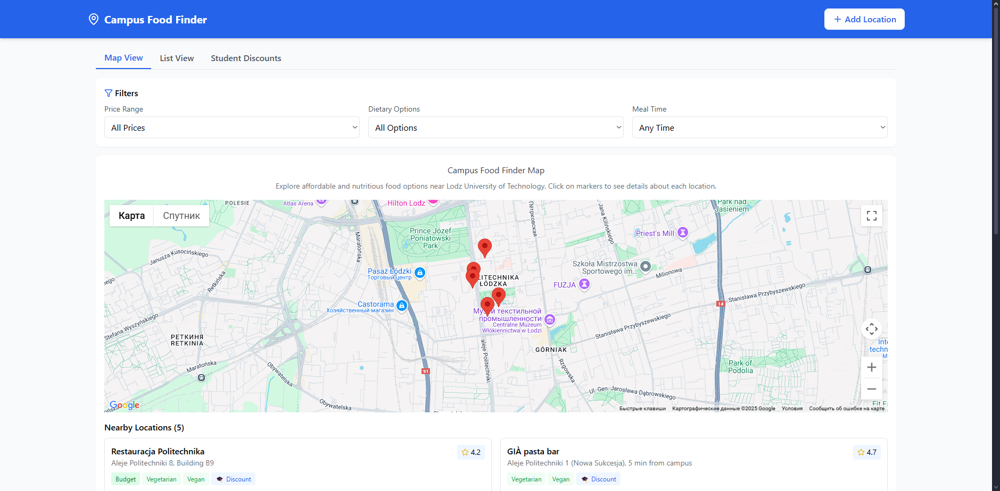

# Campus Food Finder

An interactive web application designed to help university students find affordable and nutritious food options near Lodz University of Technology.

## 🍽️ About the Project

Campus Food Finder was developed to address a significant problem identified through research: **"Lack of Centralized, Accessible Information on Affordable and Nutritious Food Options"** for university students.

Our research showed that:
- 60% of students compromise on food quality due to budget constraints
- 84.4% prioritize cost, but 60% report confusion about healthy, affordable options
- Poor food choices correlate with lower academic performance (GPA <3.0 in 45% of cases)

## ✨ Features

- **Interactive Map**: Google Maps integration showing food locations around campus
- **Comprehensive Filtering**: Filter by price range, dietary options, and meal times
- **Multiple Views**: 
  - Map view with interactive markers
  - List view for easy scanning
  - Special student discounts view
- **Detailed Information**: Each location includes:
  - Price range
  - Dietary options (vegetarian, vegan, gluten-free, halal)
  - Nutritional highlights
  - Student discounts
  - Ratings and recommendations
- **Location Submission**: Students can submit new locations via an integrated form
- **Mobile Access**: QR code for easy access on mobile devices

## 🛠️ Technologies Used

- **React**: For building the user interface
- **Google Maps API**: For interactive mapping
- **Tailwind CSS**: For responsive styling
- **Google Forms**: For location submissions
- **GitHub Pages**: For deployment

## 🚀 Live Demo

Visit the live application: [Campus Food Finder](https://Doneer.github.io/campus-food-finder)

## 📱 Mobile Access

Scan this QR code to access Campus Food Finder on your mobile device:

## 🧠 Research Background

This project is based on academic research on nutritional problems among university students (18-25 years). Key findings include:
- Students prioritize cost over nutrition, leading to poor dietary choices
- There's a lack of centralized information about affordable, healthy food options
- Time constraints further complicate healthy eating habits

Our solution directly addresses these issues by providing an easy-to-use platform that centralizes information about affordable and nutritious food options.

## 👨‍💻 Team

This application was developed as part of the Team Project course at Lodz University of Technology by Team 7.

## 📄 License

This project is licensed under the MIT License - see the [LICENSE](LICENSE) file for details.
